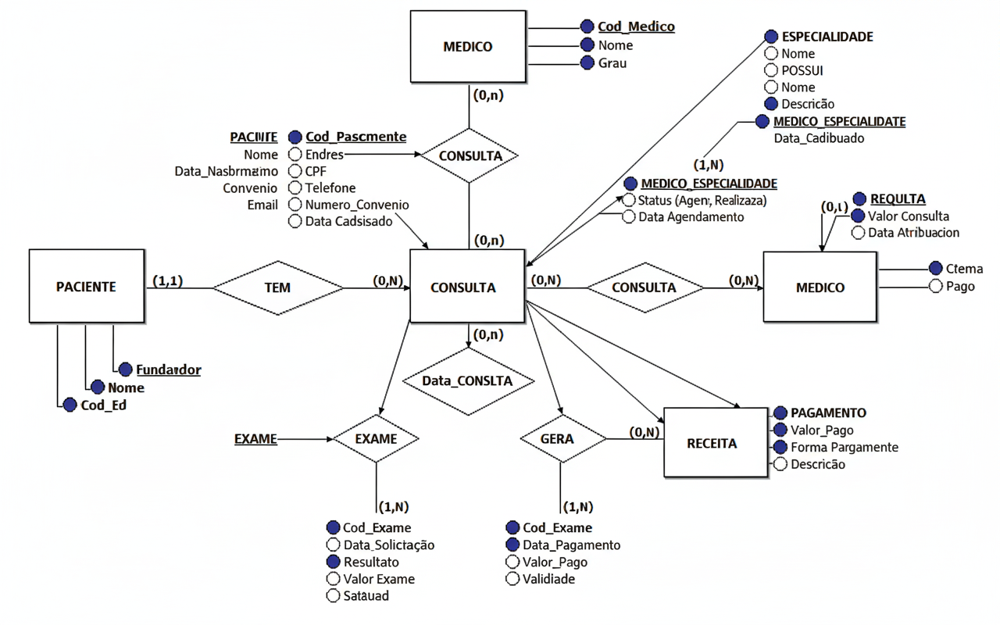

# Sistema de Gerenciamento de Clínica Médica
## Projeto de Banco de Dados - Etapa 2

### Tema Escolhido
**Sistema de Gerenciamento de Clínica Médica**

### Descrição Detalhada do Tema
O projeto tem como objetivo desenvolver um banco de dados para o gerenciamento de uma clínica médica de médio porte. O sistema deve permitir controlar pacientes, médicos, consultas, exames, receitas médicas, pagamentos e especialidades médicas.

As principais funcionalidades que o banco de dados deve suportar:

- **Cadastro de Pacientes**: nome, CPF, endereço, telefone, data de nascimento, convênio (se houver)
- **Cadastro de Médicos**: nome, CRM, especialidade, telefone, e-mail
- **Especialidades Médicas**: cada médico pode ter uma ou mais especialidades
- **Agendamento de Consultas**: data, hora, paciente, médico responsável, status (agendada, realizada, cancelada)
- **Controle de Exames**: solicitação, resultados e associação à consulta
- **Receitas Médicas**: prescrições associadas a uma consulta, com medicamentos e dosagens
- **Gestão de Pagamentos**: controle de pagamentos por consulta ou exame, considerando convênios ou particular

### Funcionalidades Principais
1. Cadastrar pacientes e médicos
2. Gerenciar especialidades médicas
3. Agendar e controlar consultas
4. Solicitar e acompanhar exames
5. Emitir receitas médicas
6. Controlar pagamentos e convênios
7. Gerar relatórios médicos e financeiros

### Regras de Negócio
- Cada médico deve ter pelo menos uma especialidade
- Consultas devem ter data/hora, paciente e médico definidos
- Exames são sempre associados a uma consulta
- Receitas médicas são emitidas durante consultas
- Pagamentos podem ser por convênio ou particular
- Consultas podem ter status: agendada, realizada, cancelada
- Cada paciente pode ter múltiplas consultas

## Diagrama Entidade-Relacionamento



## Estrutura do Projeto

```
trabalho/
├── README.md
├── docs/
│   ├── diagrama_conceitual.md
│   ├── diagrama_logico.md
│   ├── diagrama_fisico.md
│   └── imagens/
│       └── DER.png
├── scripts/
│   ├── criar_db.sql
│   ├── inserir_dados.sql
│   ├── tabelas.sql
│   └── atualizar_dados.sql
└── evidencias/
    └── teste_scripts.md
```

## Tecnologias Utilizadas
- **SGBD**: MySQL 8.0
- **Modelagem**: Diagramas ER
- **Versionamento**: Git/GitHub

## Integrantes do Grupo
- [Nome do Integrante 1]
- [Nome do Integrante 2]
- [Nome do Integrante 3]
- [Nome do Integrante 4]
- [Nome do Integrante 5]

## Como Executar
1. Clone o repositório
2. Execute o script `criar_db.sql` para criar as tabelas
3. Execute o script `inserir_dados.sql` para popular o banco
4. Execute os scripts de consulta e atualização conforme necessário
