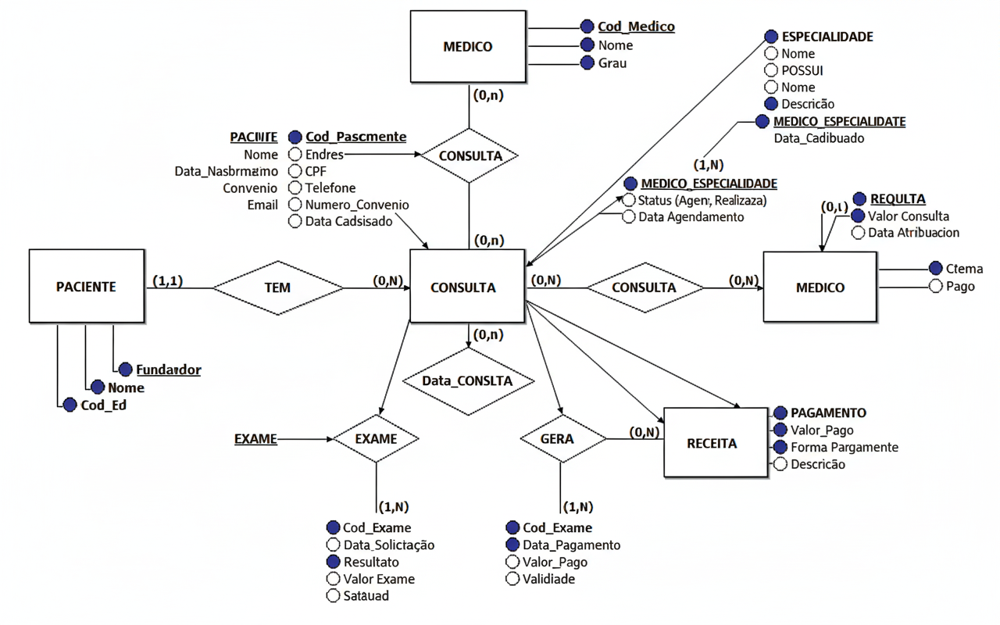

### Descrição do Sistema

O sistema controla operações de uma clínica médica: cadastro de pacientes, médicos, agendamento de consultas, controle de exames, receitas médicas e gestão de pagamentos.

#### 2. MEDICO
**Atributos:**
- id_medico (PK)
- nome
- telefone
- email
- data_cadastro
- status (ativo, inativo)

#### 3. ESPECIALIDADE
**Atributos:**
- id_especialidade (PK)
- nome
- descricao
- valor_consulta

#### 4. CONSULTA
**Atributos:**
- id_consulta (PK)
- data_consulta
- hora_consulta
- status (agendada, realizada, cancelada)
- observacoes
- valor_consulta
- data_agendamento

#### 5. EXAME
**Atributos:**
- id_exame (PK)
- nome_exame
- data_solicitacao
- data_realizacao
- resultado
- observacoes
- valor_exame
- status (solicitado, realizado, cancelado)

#### 6. RECEITA
**Atributos:**
- id_receita (PK)
- data_emissao
- medicamentos
- dosagem
- instrucoes
- validade

#### 7. PAGAMENTO
**Atributos:**
- id_pagamento (PK)
- data_pagamento
- valor_pago
- forma_pagamento (dinheiro, cartão, pix, convênio)
- status (pendente, pago, cancelado)
- descricao

### Relacionamentos

#### 1. PACIENTE ↔ CONSULTA
- **Tipo**: 1:N (Um paciente pode ter várias consultas)
- **Cardinalidade**: (1,1) : (0,N)

#### 2. MEDICO ↔ CONSULTA
- **Tipo**: 1:N (Um médico pode atender várias consultas)
- **Cardinalidade**: (1,1) : (0,N)

#### 3. MEDICO ↔ ESPECIALIDADE
- **Tipo**: N:M (Um médico pode ter várias especialidades, uma especialidade pode ter vários médicos)
- **Cardinalidade**: (1,N) : (1,N)
- **Entidade Associativa**: MEDICO_ESPECIALIDADE

#### 4. CONSULTA ↔ EXAME
- **Tipo**: 1:N (Uma consulta pode gerar vários exames)
- **Cardinalidade**: (1,1) : (0,N)

#### 5. CONSULTA ↔ RECEITA
- **Tipo**: 1:N (Uma consulta pode gerar várias receitas)
- **Cardinalidade**: (1,1) : (0,N)

#### 6. CONSULTA ↔ PAGAMENTO
- **Tipo**: 1:1 (Cada consulta tem um pagamento)
- **Cardinalidade**: (1,1) : (1,1)

#### 7. EXAME ↔ PAGAMENTO
- **Tipo**: 1:1 (Cada exame tem um pagamento)
- **Cardinalidade**: (1,1) : (0,1)

### Diagrama Conceitual (Representação Visual)



### Diagrama Conceitual (Representação Textual)

```
PACIENTE (1,1) ----< agenda >---- (0,N) CONSULTA (0,N) ----< atende >---- (1,1) MEDICO
                                            |                                   |
                                            |                                   |
                                    (1,1)   |   (0,N)                   (1,N)  |  (1,N)
                                            |                                   |
                                         EXAME                        MEDICO_ESPECIALIDADE
                                         RECEITA                            |
                                         PAGAMENTO                   ESPECIALIDADE (1,1)
```

